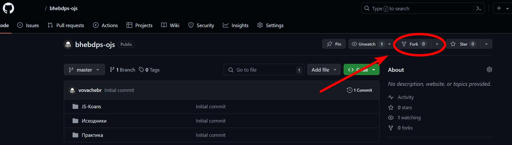
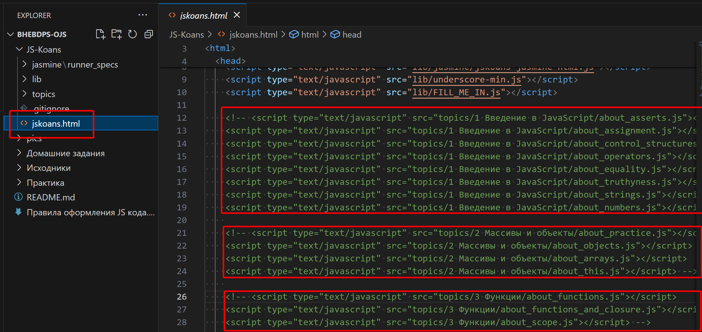

## Перед началом работы над домашним заданием

1. Произведите [Fork](https://ru.wikipedia.org/wiki/%D0%A4%D0%BE%D1%80%D0%BA) репозитория с задачами. 
После перехода на страницу с домашним заданием из личного кабинета нажмите кнопку «Fork» в правом верхнем углу страницы. Это создаст копию репозитория на вашем аккаунте GitHub.

На экране появится окно с выбором предпочтительного репозитория для клонирования проекта. Выбираете ваш аккаунт и после непродолжительного ожидания вы будете перенаправлены на страницу репозитория на вашем аккаунте.
URL-адрес этой страницы будет являться URL-адресом вашего репозитория. Пример URL адреса репозитория: `https://github.com/%username%/bhebdps-ojs`, где `%username%` - имя вашего профиля GitHub, **bhebdps-ojs** - название репозитория.

2. Клонируйте ваш форк репозитория на локальную машину.
Перейдите в папку (директорию) на вашем компьютере, где будет храниться проект.
С помощью терминала, командной строки вашей операционной системы или консоли Git (ПКМ -> GitBash Here) откройте выбранную вами директорию.
Склонируйте репозиторий с домашними заданиями с помощью команды `git clone https://github.com/%username%/bhebdps-ojs.git` в открывшемся терминале или командной строке.

3. Изучите [краткое руководство по работе с терминалом](./terminal.md)

## Необходимый набор ПО

- браузер (лучше всего подойдет Google Chrome или Яндекс.Браузер);
- редактор кода, например [Sublime][1] или [Visual Studio Code][2];
- аккаунт на GitHub ([инструкция по регистрации на GitHub][3]);
- система контроля версий [Git][4], установленная локально ([инструкция по установке Git][5]);

## Работа c коанами
1. Ознакомьтесь с содержанием репозитория.
2. В папке `JS-Koans` найдите файл `jskoans.html`, в нём закомментированы некоторые участки кода.

3. Откройте файл `jskoans.html` с помощью редактора кода, например **Sublime** или **Visual Studio Code**.
4. В файле `jskoans.html` найдите закомментированные участки кода. Расскомментируйте в нём блоки кода по теме, с которой собираетесь работать. Для этого удалите символы комментариев `<!--` и `-->`.
5. Файлы тестов разделены по темам в папке `topics`.
6. В файлах тестов по теме, с которой работаете, найдите `FILL_ME_IN` и замените на соответствующие значения или вычисления.
7. Проверьте корректность выполнения задания. Откройте файл `jskoans.html` в браузере, убедитесь, что код работает корректно и тесты проходят без ошибок.

## Сохранение домашнего задания и отправка в личный кабинет
1. Сохраните изменения в файле.
2. Добавьте изменённый файл(ы) в индекс `git` с помощью команды `git add .`, где `.` указывает на все изменённые файлы.
3. Сделайте коммит, используя команду `git commit -m '%comment%'`, где `%comment%` - это текст комментария к вашему коммиту, например, для первого задания `git commit -m 'Реализовано первое задание'`.
4. Опубликуйте код в форкнутый репозиторий с помощью команды `git push -u origin master`.
5. Прикрепите ссылку на репозиторий в личном кабинете.

[0]: https://ru.wikipedia.org/wiki/%D0%A4%D0%BE%D1%80%D0%BA
[1]: https://www.sublimetext.com/
[2]: https://code.visualstudio.com/
[3]: https://github.com/netology-code/guides/tree/master/github
[4]: https://git-scm.com/
[5]: https://github.com/netology-code/guides/blob/master/git/README.md